# TaskVerse Architecture & Flow Diagrams
Professional architecture diagrams for **TaskVerse**.
Style goal: clean, interview-friendly, Excalidraw-like system blocks with short labels and clear arrows.
> These diagrams use GitHub-compatible Mermaid syntax.
---
## 1. High-Level System Architecture
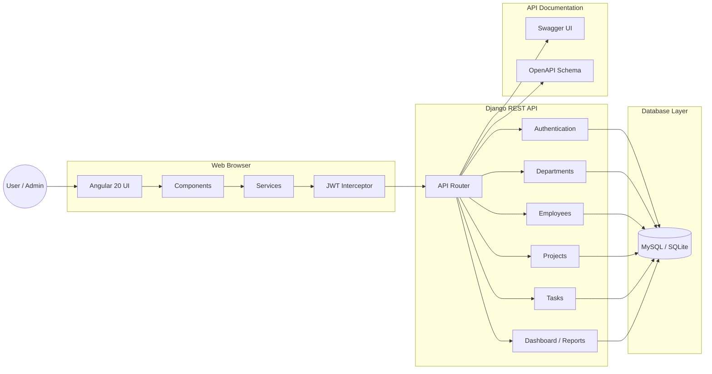
**Explanation:**
TaskVerse has an Angular frontend, a Django REST API backend, and a database layer. Angular talks to Django through services, the JWT interceptor attaches tokens, and Django apps handle business modules.
---
## 2. Application Flow
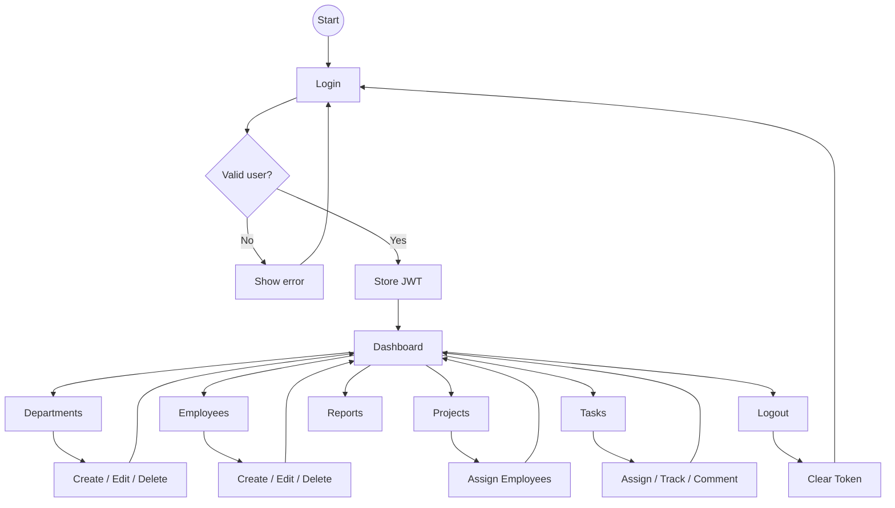
**Explanation:**
Users log in first, then land on the Dashboard. From the Dashboard they can manage departments, employees, projects, tasks, comments, and reports. Logout clears the JWT session.
---
## 3. Database ER Diagram
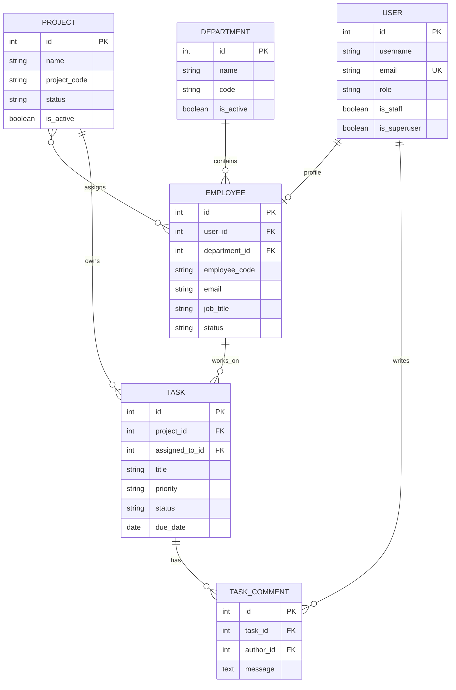
**Explanation:**
Departments contain employees. Projects can have many employees. Tasks belong to projects and can be assigned to employees. Users authenticate and can write task comments.
---
## 4. Authentication Flow
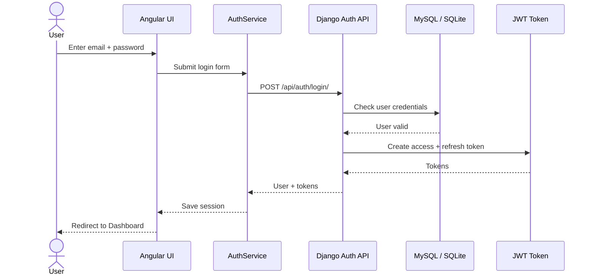
**Explanation:**
The login API validates the user and returns JWT tokens. Angular stores the token and uses it for protected pages and API calls.
---
## 5. Protected API Request Flow
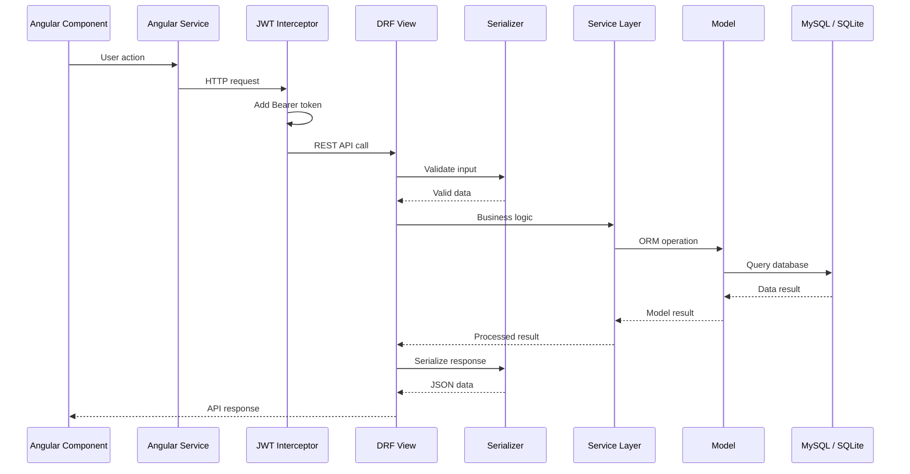
**Explanation:**
Angular components call services. Services call REST APIs. Django validates input using serializers, processes logic, updates models, queries the database, and returns JSON responses.
---
## 6. Module Relationship Diagram
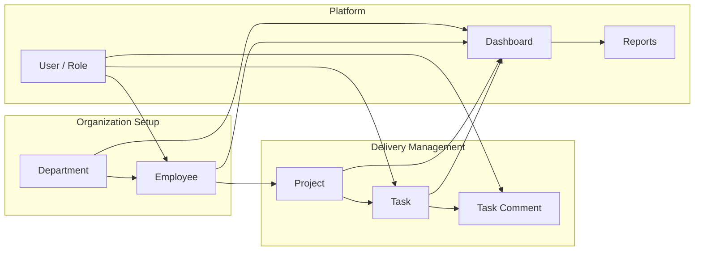
**Explanation:**
The main business flow starts from departments, then employees, then projects, then tasks. Dashboard and reports summarize data from all modules.
---
## 7. Task Workflow
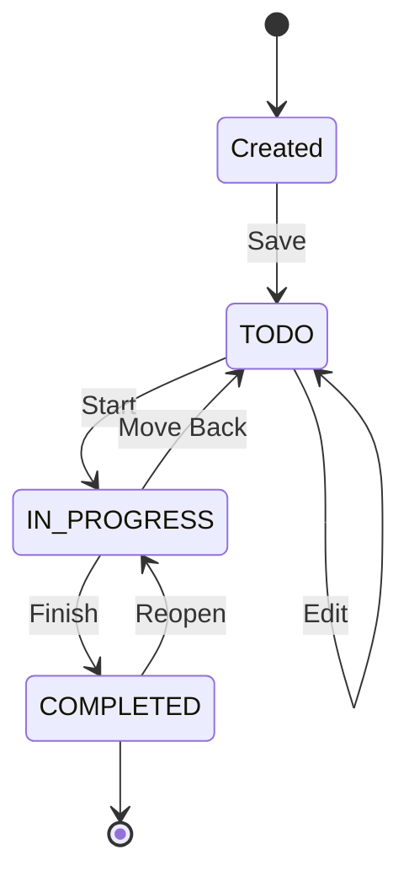
**Explanation:**
A task starts as created, then moves to TODO, IN_PROGRESS, and COMPLETED. The workflow also supports editing, moving back, and reopening if required.
---
## 8. Backend & Frontend Folder Architecture
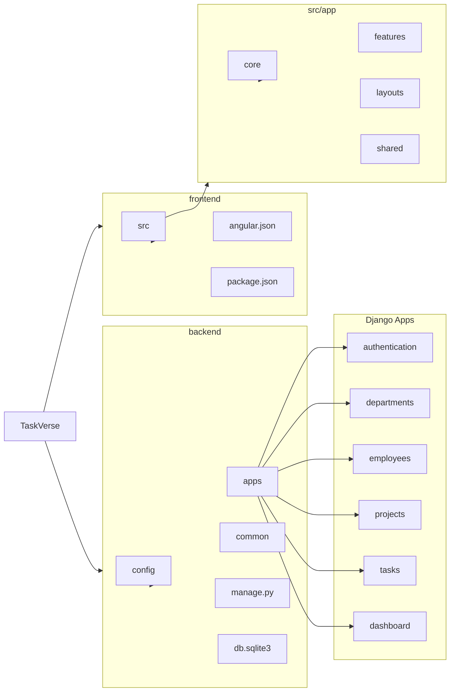
**Explanation:**
The backend is separated into Django apps and shared utilities. The frontend is separated into Angular core services, feature pages, layout components, and shared UI components.
---
## 9. Backend Folder Architecture
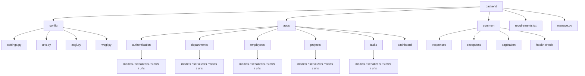
**Explanation:**
The backend uses modular Django apps. Each module owns its API views, serializers, models, URLs, validations, and service logic.
---
## 10. Frontend Folder Architecture
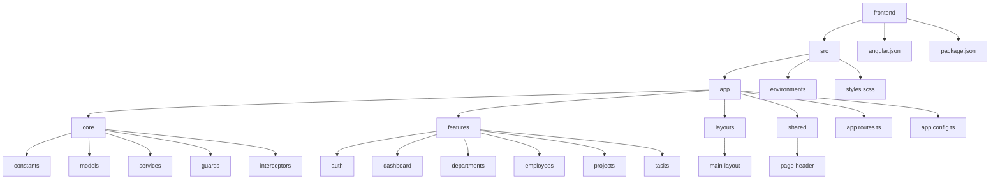
**Explanation:**
The frontend follows Angular feature-based structure. Core contains API logic and shared infrastructure, while features contain the actual pages.
---
## 11. Admin Control Flow
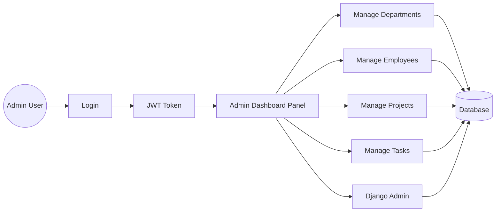
**Explanation:**
Admin users have full control. They can manage all business modules from the Angular dashboard and also access Django Admin for backend-level data management.
---
## 12. Interview-Friendly Summary
TaskVerse follows a clean full-stack architecture:
- **Angular 20** handles the UI.
- **Angular services** call REST APIs.
- **JWT interceptor** attaches access tokens.
- **Django REST Framework** exposes backend APIs.
- **Serializers** validate request and response data.
- **Service layer and models** handle business logic and database operations.
- **MySQL / SQLite** stores persistent data.
- **Swagger / OpenAPI** documents and tests backend APIs.
This architecture is modular, scalable, secure, and easy to explain in interviews.
