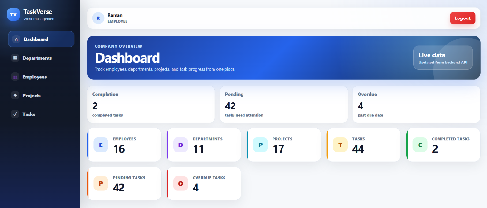

# TaskVerse

A scalable TaskVerse system to manage employees, departments, projects, and tasks using Angular 20, Python, Django REST Framework, and MySQL.

> Phase 1 currently contains the backend foundation and authentication API. The project is being built module-by-module so every module is verified before the next one starts.

## Features Roadmap

### Completed in Phase 1

- Django backend project structure
- Django REST Framework setup
- JWT authentication setup
- Custom user model
- Register, login, logout, profile, change-password APIs
- Swagger/OpenAPI documentation setup
- CORS setup for Angular frontend
- Environment-based database configuration
- MySQL-ready settings using PyMySQL
- Local SQLite fallback for development validation
- Central API response helper
- Central exception handler
- Standard pagination class
- Logging configuration
- Health check API
- Django tests for authentication basics
- Department CRUD APIs
- Department duplicate-name and duplicate-code validation
- Department API tests
- Employee CRUD APIs
- Employee belongs-to-department relationship
- Employee duplicate email and duplicate employee-code validation
- Employee API tests
- Project CRUD APIs
- Assign employees to projects
- Change project status
- Project duplicate-name and duplicate-code validation
- Project API tests
- Task CRUD APIs
- Task assignment and task status changes
- Task priority and due-date validation
- Task comments
- Task API tests
- Dashboard summary API
- Reports APIs for employees by department, tasks by employee, pending tasks, completed tasks, and project progress
- Dashboard/report API tests
- Angular 20 frontend foundation
- Angular auth flow with login and register pages
- JWT token storage and auth interceptor
- Auth guard for protected dashboard route
- Dashboard summary page integrated with backend API
- Main app layout and 404 page
- Angular Departments page with list, search, create, edit, and delete
- Angular feature pages refactored into container + smaller child components
- Angular Tasks page with list, filters, create, edit, delete, and comments

### Planned Modules

- Angular profile page and UI polish

## Tech Stack

### Backend

- Python 3.12
- Django 5.2
- Django REST Framework
- Simple JWT
- drf-spectacular
- django-filter
- django-cors-headers
- PyMySQL

### Frontend

- Angular 20
- Angular Router
- HttpClient
- Reactive Forms
- SCSS

### Database

- MySQL for portfolio/project target
- SQLite is used only for local Phase 1 validation when MySQL is unavailable

## Folder Structure

```text
TaskVerse/
├── backend/
│   ├── apps/
│   │   ├── authentication/
│   │   ├── departments/
│   │   ├── employees/
│   │   ├── projects/
│   │   ├── tasks/
│   │   └── dashboard/
│   ├── common/
│   │   ├── constants/
│   │   ├── exceptions/
│   │   ├── pagination/
│   │   ├── permissions/
│   │   ├── responses/
│   │   └── validators/
│   ├── config/
│   ├── media/
│   ├── services/
│   ├── tests/
│   ├── utils/
│   ├── manage.py
│   └── requirements.txt
├── frontend/
└── README.md
```

## Backend Setup

> Because this project path is long on Windows, a temporary `T:` drive mapping is useful for Python package operations. It still points to this project folder; it does not move files outside the project.

```powershell
$target = "C:\path\to\your\project\folder\TaskVerse"
subst T: /D 2>$null
subst T: $target
Set-Location T:\
```

Create and activate the virtual environment:

```powershell
py -m venv .venv
.\.venv\Scripts\Activate.ps1
python -m pip install --index-url https://pypi.org/simple -r backend\requirements.txt
```

Run backend checks and migrations:

```powershell
Set-Location T:\backend
..\.venv\Scripts\python.exe manage.py check
..\.venv\Scripts\python.exe manage.py migrate
..\.venv\Scripts\python.exe manage.py test
```

Run the API server:

```powershell
Set-Location T:\backend
..\.venv\Scripts\python.exe manage.py runserver 127.0.0.1:8000
```

## Frontend Setup

Install dependencies and run the Angular app:

```powershell
Set-Location frontend
npm install
npm start
```

Build the Angular frontend:

```powershell
Set-Location frontend
npm run build
```

Frontend URL:

- Angular app: <http://localhost:4200/>

The frontend currently connects to the backend API at:

```text
http://127.0.0.1:8000/api
```

### Frontend Component Structure Rule

Feature pages are organized as lightweight routed container components plus smaller child components.

```text
features/departments/
├── departments.component.ts
└── components/
	├── department-form.component.ts
	└── department-table.component.ts

features/employees/
├── employees.component.ts
└── components/
	├── employee-form.component.ts
	└── employee-table.component.ts

features/projects/
├── projects.component.ts
└── components/
	├── project-form.component.ts
	└── project-table.component.ts

features/tasks/
├── tasks.component.ts
└── components/
	├── task-form.component.ts
	├── task-table.component.ts
	└── task-comments.component.ts
```

The routed page/container owns API calls and state. Child components receive data via inputs and emit UI actions via outputs.

## API Documentation

After starting the backend server:

- Swagger UI: <http://127.0.0.1:8000/api/docs/>
- OpenAPI schema: <http://127.0.0.1:8000/api/schema/>
- Health check: <http://127.0.0.1:8000/api/health/>

## Authentication APIs

| Method | Endpoint | Access |
| --- | --- | --- |
| POST | `/api/auth/register/` | Public |
| POST | `/api/auth/login/` | Public |
| POST | `/api/auth/token/refresh/` | Public |
| GET | `/api/auth/profile/` | JWT required |
| POST | `/api/auth/change-password/` | JWT required |
| POST | `/api/auth/logout/` | JWT required |

## Department APIs

| Method | Endpoint | Access |
| --- | --- | --- |
| GET | `/api/departments/` | JWT required |
| POST | `/api/departments/` | JWT required |
| GET | `/api/departments/{id}/` | JWT required |
| PUT | `/api/departments/{id}/` | JWT required |
| PATCH | `/api/departments/{id}/` | JWT required |
| DELETE | `/api/departments/{id}/` | JWT required |

## Employee APIs

| Method | Endpoint | Access |
| --- | --- | --- |
| GET | `/api/employees/` | JWT required |
| POST | `/api/employees/` | JWT required |
| GET | `/api/employees/{id}/` | JWT required |
| PUT | `/api/employees/{id}/` | JWT required |
| PATCH | `/api/employees/{id}/` | JWT required |
| DELETE | `/api/employees/{id}/` | JWT required |

## Project APIs

| Method | Endpoint | Access |
| --- | --- | --- |
| GET | `/api/projects/` | JWT required |
| POST | `/api/projects/` | JWT required |
| GET | `/api/projects/{id}/` | JWT required |
| PUT | `/api/projects/{id}/` | JWT required |
| PATCH | `/api/projects/{id}/` | JWT required |
| DELETE | `/api/projects/{id}/` | JWT required |
| POST | `/api/projects/{id}/assign-employees/` | JWT required |
| POST | `/api/projects/{id}/change-status/` | JWT required |

## Task APIs

| Method | Endpoint | Access |
| --- | --- | --- |
| GET | `/api/tasks/` | JWT required |
| POST | `/api/tasks/` | JWT required |
| GET | `/api/tasks/{id}/` | JWT required |
| PUT | `/api/tasks/{id}/` | JWT required |
| PATCH | `/api/tasks/{id}/` | JWT required |
| DELETE | `/api/tasks/{id}/` | JWT required |
| POST | `/api/tasks/{id}/assign/` | JWT required |
| POST | `/api/tasks/{id}/change-status/` | JWT required |
| GET | `/api/tasks/{id}/comments/` | JWT required |
| POST | `/api/tasks/{id}/comments/` | JWT required |

## Dashboard and Report APIs

| Method | Endpoint | Access |
| --- | --- | --- |
| GET | `/api/dashboard/summary/` | JWT required |
| GET | `/api/reports/employees-by-department/` | JWT required |
| GET | `/api/reports/tasks-by-employee/` | JWT required |
| GET | `/api/reports/pending-tasks/` | JWT required |
| GET | `/api/reports/completed-tasks/` | JWT required |
| GET | `/api/reports/project-progress/` | JWT required |

## MySQL Configuration

Create a MySQL database manually when MySQL is available:

```sql
CREATE DATABASE smart_employee_task_db CHARACTER SET utf8mb4 COLLATE utf8mb4_unicode_ci;
```

Then update `backend/.env`:

```dotenv
DB_ENGINE=mysql
DB_NAME=smart_employee_task_db
DB_USER=root
DB_PASSWORD=your_mysql_password
DB_HOST=127.0.0.1
DB_PORT=3306
```

Run migrations again:

```powershell
Set-Location T:\backend
..\.venv\Scripts\python.exe manage.py migrate
```

## Screenshots

### Dashboard Summary


## Future Improvements

- Role-based permissions for Admin, Manager, and Employee
- Dashboard charts
- More report filters
- Employee profile image uploads
- Better Angular UI polish

